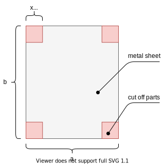

# Optimalizace

## 

## Než začneme

Doporučuji si vytvořit prázdné virtuální prostředí (já ho obvykle pojmenovávám ".venv"):

```
python -m venv .venv
```

Aktivujeme ho:

```
/.venv/Scripts/activate
```

Nainstalujeme potřebné knihovny:

```
pip install cvxpy
```


## Úvod

Optimalizace je snaha o nalezení maxima nebo minima *účelové funkce*. V praxi se s optimalizací setkáte hodně často. Pokud budete například vyrábět papírové krabičky, budete chtít aby se co nejvíce krabiček vyrobilo z co nejméně papíru.

Typicky se optimalizace už dlouhou dobu používá při jakémkoli plánování (například kdy má a kdy nemá běžet blok uhelné elektrárny, kdy a na jakém stroji se má jaký díl vyrobit), nebo také jakou trasou má projet zásobovací vůz, aby spálil co nejméně benzínu (nebo aby byl co nejrychlejší). Úloh je nepřeberné množství a jako budoucí inženýři se dříve či později s optimalizací v nějaké podobě potkáte. 


## Úkol 1 - Svařované krabičky

První úloha bude velmi jednoduchá. Ve skutečnosti nebudete potřebovat nic víc, než tužku a papír. My si ale řešení naprogramujeme jako velmi jednoduchý skript, nebudeme zatím potřebovat žádné speciální knihovny.

Máme firmu na výrobu svařovaných krabiček. Výrobce plechů nám dodává plech o šířce *a* a výšce *b*. Naším úkolem je zjistit, jak velké kusy v rozích odstřihnout, abychom maximalizovali objem krabičky. Krabička nemá víko, má jenom dno a čtyři strany (viz následující obrázek).



Jaké bude tedy x pro konkrétní parametry *a*, *b* tak, aby objem byl co největší.

Objem krabičky tedy bude:


Tedy bychom mohli napsat:


