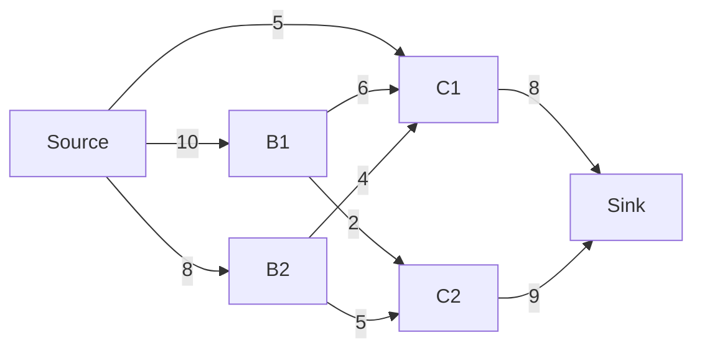
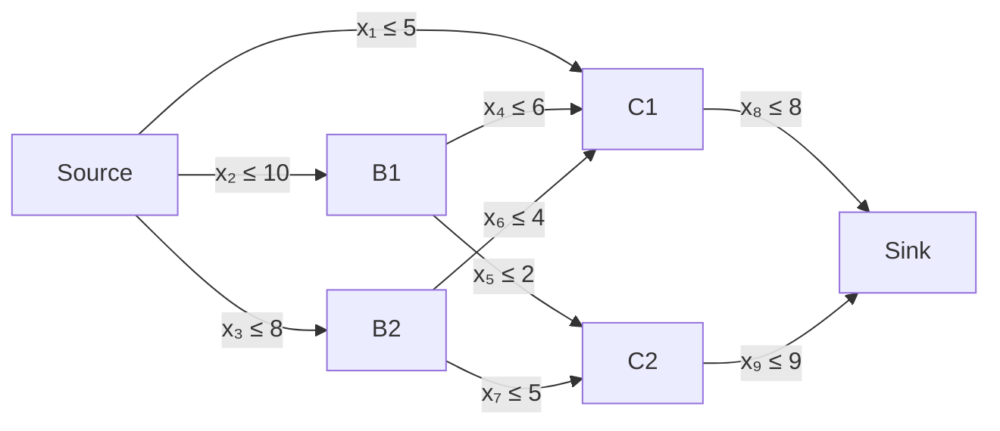

# Convex Optimization

## Linear Programming

Let us consider a constrained optimization problem in the form

$$
\begin{aligned}
	\max_{\mathbf{x}} & \quad \mathbf{c}^\top \mathbf{x} \\
	\text{s.t.} & \quad \mathbf{A} \mathbf{x} \leq \mathbf{b} \\
	            & \quad \mathbf{x} \geq \mathbf{0} .
\end{aligned}
$$

### Car importer
A car importer is planning to import two models of JDM cars. In one shipment he can transport 60 cars and investment of 50 million CZK. The purchase price of the two models is 2.5 million and 0.5 million CZK. He then expects a profit of 250 thousand CZK per unit sold of the first model and 75 thousand CZK of the second model. How many units of each model should he buy to maximize his profit, expecting every car will be sold?

#### Mathematical model
$$
\begin{aligned}
	\max_{x_1, x_2} & \quad 0.25 x_1 + 0.075 x_2 \\
	\text{s.t.} & \quad x_1 \geq 0, x_2 \geq 0 \\
							& \quad x_1 + x_2 \leq 60 \\
							& \quad 2.5 x_1 + 0.5 x_2 \leq 50
\end{aligned}
$$

#### Code
- [CVXPY](car_import.py)

### Flow optimization
We have a network (represented as directed graph). The graph has a "Source" of a medium (it can be for example gas, water or electricity) and Sink with additional nodes in between. All edges between source and sink has defined maximal capacity.

What is the maximum amount medium we can transmit through the sink?

#### Mathematical model

Let us first define our optimization variables $x_i$ as individual flows through the edges of our graph

we may then write the problem as

$$
\begin{aligned}
	\max_{\mathbf{x}} & \quad x_8 + x_9 \\
	\text{s.t.} & \quad \mathbf{0} \leq \mathbf{x} \leq \mathbf{u} \\
							& \quad x_4 + x_5 = x_2 \\
	            & \quad x_6 + x_7 = x_3 \\
	            & \quad x_8 = x_5 + x_6 + x_4 \\
	            & \quad x_9 = x_5 + x_7 \\
\end{aligned}
$$
where
$$
\mathbf{u}^\top = \begin{bmatrix} 5 & 10 & 8 & 6 & 2 & 4 & 5 & 8 & 9 \end{bmatrix}
$$

#### Code
- [python - CVXPY](flow.py)

## Quadratic Programming

Let us consider a constrained optimization problem in the form

$$
\begin{aligned}
	\min_{\mathbf{x}} & \quad \frac{1}{2} \mathbf{x}^\top \mathbf{Q} \mathbf{x} + \mathbf{c}^\top \mathbf{x} \\
	\text{s.t.} & \quad \mathbf{A} \mathbf{x} \leq \mathbf{b} ,
\end{aligned}
$$

where $\mathbf{Q} \succeq 0$.

### Economic dispatch
We have three power plants each producing electricity to satisfy the demand of $P_{\Sigma} = 3000$ MW. Each of the power plants has a minimum and maximum capacity $P_{i_{\min}}$ and $P_{i_{\max}}$ and a quadratic cost model associated with its power output $l_i = a_i + b_i P_i + c_i P_i^2$. The capacity limits and cost coefficients are provided in the table bellow.

| $i$         | $a_i$ | $b_i$ | $c_i$ | $P_{i_{\min}}$    | $P_{i_{\max}}$    |
|-------------|-------|-------|-------|-------------------|-------------------|
| 1           | 20    | 5     | 0.02  | 200               | 1000              |
| 2           | 25    | 4     | 0.015 | 300               | 1500              |
| 3           | 30    | 3     | 0.01  | 100               | 800               |

#### Mathematical model

$$
\begin{aligned}
	\min_{P_1,P_2,P_3} & \quad \sum_{i=1}^{3} a_i + b_i P_i + c_i P_i^2 \\
	\text{s.t.} & \quad \sum_{i=1}^{3} P_i = P_{\Sigma} \\
	            & \quad P_{i_{\min}} \leq P_i \leq P_{i_{\min}} ,\quad i = 1, \ldots, 3\\
\end{aligned}
$$
