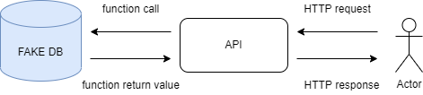
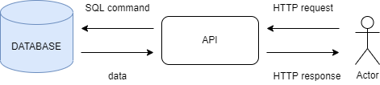
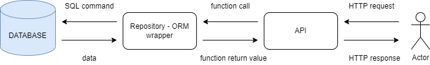
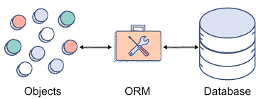
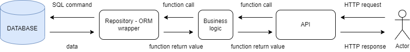

# Web service - chapter 2

We will create and connect our own `SQLite` database with our application from the last lecture. We will be using ORM (**O**bject-**R**elational **M**apping)technique to work with the database. This approach allows us to work with database entities as if they were Python objects, thus we can almost ignore SQL language which is commonly used to work with relational databases. For our work, we will need the Python library `SQLAlchemy`.

We will jump to code soon but first, we should understand what we want to achieve:

In the first scheme, you see the state of our application after the last lesson. We use the so-called `fake_db` which we can access as if it was a Python object. But now we want to add a real database:

Now we would have to use SQL commands if we wanted to get data from the database. This would mean for you to learn a whole new language and that is something we don't have time for (but definitely, you should have a look at it someday :-)). So we need to be able to access the database with already known Python means and here the ORM kicks in as it allows us to use Python objects for database access. We just need to prepare some kind of wrapper:

In the scheme, you can see that we have added a new entity between API and Database. We call it Repository and it will be a class that will use SQL commands to access the database while we will be using only Python objects and their methods.

## ORM
A way to map objects to database entities:

## Business layer

In real applications, there are a few other things that we don't mention in our course for sake of simplicity. One of them is a business logic layer which is used as an intermediator between API and Repository. It should be responsible for all logic inside our application. The business layer would take orders from API then it would decide which data it should retrieve from the database in compliance with its own logic and constraints. If we would implement it the scheme of our app would look like this:

