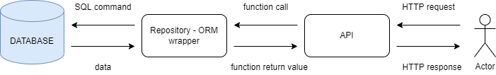
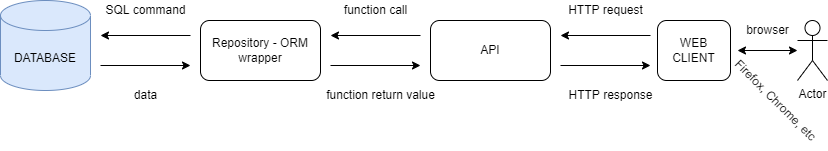

# Web service - chapter 3

Today we will create our web client using Fastapi API and the database we have from the last lectures. For our client, we will prepare something like another API as we did before but this time it will be different. Instead of just a simple HTTP response, we will be sending the whole HTML web page. To achieve this we will use templating engine Jinja2 with our Fastapi API. 

We will jump to code soon but first, we should understand what we want to achieve:

In the first scheme, you see the state of our application after the last lesson. We have implemented a proper database and we can access it with the former API. This is something we will improve now. We want to add our own frontend in front of our API so the user can access our application with his browser. The scheme of our application will look like this after this lecture:

